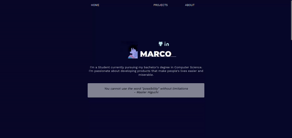

# RainbowKappa's Portfolio Site | KappaBox.LIVE

## Table of Contents
ℹ️ [Kappabox.LIVE](http://play.kappabox.live/)  
ℹ️ [Legacy Kappabox.LIVE (Jackbox.TV Web-End Mods)](http://legacy.kappabox.live/)  
ℹ️ [List of Works](#works)  
ℹ️ [List of Worktypes](#types)  
ℹ️ [List of Site Icons](#icons)  
ℹ️ [List of Site BGM](#bgm)  
ℹ️ [List of Site Videos](#videos)  
ℹ️ [List of Project Teams](#teams)  

# works
- [Legacy Kappabox.LIVE (Jackbox.TV Web-End Mods)](http://legacy.kappabox.live/) | RainbowKappa, KappaBox LIVE, Original KappaBox.LIVE Site | 2021-2024
- [Wii Music Rii-Arranged (Melodii: A Wii Music Mod)](http://wmra.kappabox.live/) | Wii Music Rii-Arranged Team | 2021-2024
- [Trivia Beta64 Party](http://triviabetaparty.kappabox.live/) | KappaBox LIVE, CNR Team (V5) | 2021-2023 
- [Scott Boat](http://scottboat.kappabox.live/) | KappaBox LIVE, CNR Team (V2) | 2021-2023 
- [Trivia Murder Party 2 : The Suncracker0 Mod](http://triviasunparty.kappabox.live/) | RainbowKappa, Drago2143 | 2022
- [Suncracker Drawn](http://sundrawn.kappabox.live/) | RainbowKappa | 2022
- [Beta64 Goes On Wipeout (A Cheese Nips Rescue 3 Prototype)](http://bgowo.kappabox.live/) | CNR Team | 2022
- [Kappabox.LIVE](http://play.kappabox.live/) | RainbowKappa, Main Portfolio Site | 2024
- [BoyKisserang (April Fools 2024 Mod)](http://boykisserang.kappabox.live/) | RainbowKappa | 2024
- [Bandy Points](http://bandypoints.kappabox.live/) | RainbowKappa, Bandy Points Special Thanks and Co. | 2024

# types
- [Beta64 Fan Project](https://beta64.tv/) | A Project Originally Designed for The Beta64 Community.
- [Cheese Nips Rescue](https://emcot.world/Cheese_Nips_Rescue) | A Project that is considered by CNR Team as a entry in its' Cheese Nips Rescue series of games. 
- [Jackbox Modification](https://jackboxgames.com/) | A Project That Modifies One of Jackbox Games' Party Pack Games.
- [KappaBox LIVE](http://legacy.kappabox.live/) | A Project That Utilizes (Legacy) KappaBox.LIVE's Modified Jackbox Client.
- [Suncracker0 Fan Project](https://www.twitch.tv/sunsoldout) | A Project Originally Designed for The Suncracker0 Community.
- [Wii Music Modification](https://en.wikipedia.org/wiki/Wii_Music) | A Project That Modifies The 2008, Nintendo Wii Game, Wii Music.

# icons
- channels4_profile.ico is used as the main portfolio site's icon, which is the current branding for RainbowKappa.
- a variation of channels4_profile.ico , or the current branding for RainbowKappa, can be seen on the legacy KappaBox.Live without it's background.

# bgm
- [Luigi's Mansion Zone](https://youtu.be/6k3Y2pYy0RU?list=PLlX1VfsC0AzxdEgAgvPb2S_eE2kwgu5B5) | Luigi's Mansion Zone | Trivia Beta64 Party Soundtrack, SuperMarioBrosFan116
- [I Got Banned From Scott Boat (Cashspoon Mix)](https://youtu.be/pfoz2qmDFrg?list=PLlX1VfsC0AzxdEgAgvPb2S_eE2kwgu5B5) | I Got Banned From Scott Boat (Cashspoon Mix) | Trivia Beta64 Party Soundtrack, Cashspoon
- [I Got Banned From Scott Boat (Whistle Mix)](https://youtu.be/klqGMxXWCCE) | I Got Banned From Scott Boat (Whistle Mix), RainbowKappa
- [What a Wonderful World (Cover)](https://www.youtube.com/watch?v=9hSHDy44_uo&list=PLlX1VfsC0AzzIlgZiSc2k4vp3uR5KRvuZ&index=1) | What a Wonderful World (Cover) | Trivia Murder Party 2 : The Suncracker0 Mod Soundtrack, Suncracker0
- [(UNUSED) old_mod_final.wav](https://youtu.be/f_M4Ui1-hoQ?list=PLlX1VfsC0AzxdEgAgvPb2S_eE2kwgu5B5) | (UNUSED) old_mod_final.wav | Trivia Beta64 Party Soundtrack, RainbowKappa

# videos
- [V5 Release Trailer + Download](https://youtu.be/D11BjdXBTWc) | Trivia Beta64 Party | V5 Release Trailer + Download, RainbowKappa
- [Playtest Session - 7/2/2023](https://www.youtube.com/watch?v=SPKSDPKJn9Y) | Scott Boat | Playtest Session - 7/2/2023, RainbowKappa

# teams

- CNR Team Members:
  - [Cashspoon](https://www.twitch.tv/Cashspoon)
  - [RainbowKappa](https://www.twitch.tv/RainbowKappaTTV)
  - [DizmondTV](https://www.twitch.tv/DizmondTV)
  - [SuperMarioBrosFan116](https://www.twitch.tv/SuperMarioBrosFan116)
  - [ScottNoLastName]()
    
-  KappaBox LIVE Mod Contributors:
   - [RainbowKappa](https://www.twitch.tv/RainbowKappaTTV)
   - [Cashspoon](https://www.twitch.tv/Cashspoon)
   - [DizmondTV](https://www.twitch.tv/DizmondTV)
   - [SuperMarioBrosFan116](https://www.twitch.tv/SuperMarioBrosFan116)
   - [ScottNoLastName]()
   - [Megazeroex3]()
   - [Memeguuy]()
   - [Chips McGee]()
   - [JJDB210](https://www.twitch.tv/JJDB210)
   - [HexenHell](https://www.twitch.tv/hexenhell)
   - [Drago2143](https://drago2143.neocities.org/)
    
- Suncracker0 Jackbox Mod Contributors:
   - [RainbowKappa](https://www.twitch.tv/RainbowKappaTTV)
   - [Drago2143](https://drago2143.neocities.org/)
   - [OfficialNoah21](https://twitch.tv/officialnoah21)

- Wii Music Rii-Arranged Team:
   - [CheckerTheJester]()
   - [RainbowKappa](https://www.twitch.tv/RainbowKappaTTV)
   - [Benjamin Halko](https://www.youtube.com/c/benjaminhalko)
   - [Kozakura]()
   - [LibraGames]()
   - [Gavin Krolczyk]()


# Original Repo Contents
ℹ️ [Original Repo By notshanxx](https://github.com/notshanxx/plainfolio)

## Plainfolio
:flags: A plain portfolio template for everyone

ℹ️ [Live Preview](https://plainfolio.vercel.app/)

<!--
<p align="center">

</p>
-->

## Features

:pushpin: Fast  
:pushpin: Simple  
:pushpin: One Page  
:pushpin: Reponsive  
:pushpin: Begginer Friendly  
:pushpin: Easy to Customize  


## Table of Contents

- [Prerequisites](#prerequisites)
- [Deploy](#deploy)
- [How to use](#how-to-use)
- [Configuring the template](#configuring-the-template)
- [Changing site color](#changing-color)
- [HTML Sections](#html-sections)
  - [Editing HOME Section](#editing-home-section)
    - [Editing the Profile Picture](#editing-the-profile-picture)
    - [Editing the Social Medias](#editing-the-social-medias)
      - [Add more Social Media Icons](#add-more-social-media-icons)
    - [Editing the Name](#editing-the-name)
    - [Editing the Bio](#editing-the-bio)
    - [Editing the Quote](#editing-the-quote)
  - [Editing PROJECTS section](#editing-projects-section)
    - [PROJECT TEMPLATE](#project-template)
  - [ABOUT SECTION](#about-section)
    - [Changing About Image](#editing-about-image)
    - [Editing Your About Name](#editing-your-about-name)
    - [Editing About Social Media](#editing-the-social-medias)
    - [Editing Your About Long Bio](#editing-your-about-long-bio)
    - [Editing Your Skills](#editing-your-skills)
  - [Others](#others)
     - [Enable Scrolling](#enable-scrolling)
     - [Remove Quote](#remove-quote)
     - [Remove Hover Script](#remove-hover-script)

Follow the folllowing instruction to get the project and run it locally to your computer

### Prerequisites

You will need the following:

- [Git](https://git-scm.com/)
- [Node.js](https://nodejs.org/en/download)
- [Visual Studio Code](https://code.visualstudio.com/)

```
Vite requires Node.js version 14.18+, 16+ or higher
```

- Should know basic HTML

## How to use

First open your Terminal / Command Prompt

Now clone the repository by entering these

```bash
# Clone the repository
$ git clone https://github.com/notshanxx/plainfolio.git

# Change directory into the repository
$ cd plainfolio

# Remove the current origin repository
$ git remote remove origin

# open in VS Code editor
$ code .
```

Open the New Terminal in the Visual Studio Code at the up left corner or `` [Ctrl + `] ``

After that run

```bash
# Install dependencies
$ npm install

# Run dev server
$ npm run dev
```

After running the `npm run dev`. You should see the following below

```bash

  ➜  Local:   http://localhost:5173/
  ➜  Network: use --host to expose
  ➜  press h to show help

```

Congratulation!!! You can now go to the url `http://localhost:5173/` and view the portfolio


## Deploy

To know how to deploy this and run it online. Follow this [documentation](https://vitejs.dev/guide/static-deploy.html) 

## Configuring the Template

Now to change the default informations.
Go to the `index.html` located at the root folder and follow the following guide.

### Changing Color

Go to the `styles.css` located at the root folder and follow the following guide.

In the first line you will see the `:root`

change only the variable inside it.

```css

:root {
  --bg-color: #070a2d;
  --font-color: #cdced5;
  --link-color: lightblue;
  --text-color-1: rgba(0, 179, 119, 1); 
  --text-color-2: rgba(214, 255, 127, 1);
  --headline-color: white;
}
```


  --bg-color  -the background

  --font-color  -the font color

  --link-color  -the link color

  --text-color-1   -the green color in the site

  --text-color-2  -the yellow collor in the site

  --headline-color  -the h color


### HTML Sections

There's only 3 section to add your infos `The HOME, PROJECTS and ABOUT`

To change or add images or svg. Put your file in the `/asset` folder.  
For image `./asset/img`  
For svg `./asset/svg`

Get SVG in [Feathericons](https://feathericons.com/) if you want to add socials

#### Editing HOME Section

THINGS TO BE EDITED IN HOME SECTION

- your image
- your name
- social media urls
- your bio
- your quote

##### Editing the Profile Picture

To edit the image find these in `index.html`.
Edit the img src by adding your own image in `/asset/img` and copy and paste it's relative path in src like the one below.

```html
<div class="img-container">
  
</div>
```

##### Editing the Social Medias

To edit the social medias find these in `index.html`.
Edit the `href` to your own url.
Get SVG in [Feathericons](https://feathericons.com/) or other sources.

```html
<div class="social-container">
  <!-- GITHUB -->
  <a href="https://github.com/notshanxx" target="_blank"
    ></a>

  <!-- LINKEDIN -->
  <a
    href="https://www.youtube.com/watch?v=dQw4w9WgXcQ&ab_channel=RickAstley"
    target="_blank"
    ></a>
</div>
```

###### Add more Social Media Icons

To add more social media icons. Just follow this template below.  
Edit it's `href` and the `img src`.
Find icons online and add it at`asset/svg`

```html
<a href="https://github.com/notshanxx" target="_blank">
  
</a>
```

###### Editing the Name

To edit the name find these in `index.html`. Then change it

```html
<h1>MARCO</h1>
```

###### Editing the Bio

To edit the bio find these in `index.html`. Then change it

```html
<p class="user-bio">
  I’m a Student currently pursuing my bachelor's degree in Computer Science.
  <br />
  I’m passionate about developing products that make people's lives easier and
  miserable.
</p>
```

###### Editing the Quote

To edit the quote find these in `index.html`. Then change it

```html
<div class="quote-container">
  <p>
    <!-- EDIT QUOTE -->
    <i>
      You cannot use the word "possibility" without limitations <br />
      - Master Higuchi
    </i>
  </p>
</div>
```

#### Editing PROJECTS section

THINGS TO BE EDITED

- project title
- project repository url
- project short description
- project tools used
- github url

##### PROJECT TEMPLATE

to add more projects copy this template and edit the texts and urls

```html
<div class="repository-container">
  <div class="repository-head">
    <!-- EDIT YOUR PROJECTS -->

    <!-- EDIT YOUR PROJECT'S SOURCE URL-->
    <a
      href="https://github.com/notshanxx/anicard"
      target="_blank"
      rel="noopener noreferrer"
    >
      <!-- EDIT YOUR PROJECT'S TITLE -->
      <h3>anicard</h3>
    </a>

    <!-- EDIT YOUR PROJECT'S SOURCE URL -->
    <a
      href="https://github.com/notshanxx/anicard"
      target="_blank"
      rel="noopener noreferrer"
    >
      
    </a>
  </div>

  <!-- EDIT YOUR PROJECT'S DESCRIPTION -->
  <p class="repository-description">
    Create simple cards with anime information and cover on it.
  </p>
  <!-- EDIT YOUR PROJECT TOOLS USED -->
  <div class="repository-language-used-container">
    <span class="language-used">Javascript</span>
    <span class="language-used">CSS</span>
    <span class="language-used">HTML</span>
  </div>
</div>
```

#### ABOUT SECTION

THINGS TO BE EDITED IN HOME SECTION

- your image
- your name
- social media urls
- your long bio
- your skills

##### Editing About Image

find these code in the `index.html`. change the `img src`

```html
<!-- Image  -->
<div class="about-img-container">
  
</div>
```

-

##### Editing Your About Name

find these code in the `index.html`. change the name inside

```html
<h2 class="gradient">Marco Manuel</h2>
```

##### Editing About Social Media

find these code in the `index.html`. change the `img src` and the `hrefs` pointing to yours

```html
<ul class="about-social-container">
  <li>
    
    <a href="https://github.com/notshanxx/">Github</a>
  </li>

  <li>
    
    <a href="https://github.com/notshanxx/">Mail</a>
  </li>

  <li>
    
    <a href="https://github.com/notshanxx/"> LinkedIn</a>
  </li>
</ul>
```

`may break design if added more than 3`

##### Editing Your About Long Bio

find these code in the `index.html`. change the contents

```html
<!-- long bio -->
<p>
  Lorem ipsum dolor sit amet consectetur adipisicing elit. Quam repellendus
  magnam vel deleniti ea quidem aliquid veniam minima, eveniet impedit
  consequatur nemo dolorem rerum cumque sed qui ratione culpa saepe.
</p>
```

##### Editing Your Skills

find these code in the `index.html`. change/add `<li><li/>` tags

```html
<!-- Skills / Tools -->
<h3>Skills / Tools</h3>
<ul class="skill">
  <li>HTML</li>
  <li>CSS</li>
  <li>JavaScript</li>
  <li>TypeScript</li>
  <li>Phyton</li>
  <li>React</li>
  <li>Svelte</li>
  <li>Node.js</li>
  <li>Git</li>
</ul>
```

## Others

### Enable Scrolling

To enablle scrolling. Go to `styles.css`.
Clear the `overflow` or comment it.

```css
body {
  min-height: 100vh;
  background-color: var(--bg-color);
  text-align: center;
  font-family: "Work Sans", sans-serif; /* remove scroll bar and disable scroll */
  overflow: hidden;
  color: var(--font-color);
}
```

### Remove Quote

To remove the quote. Go to `index.html` and find this `<div>` and comment it out or clear it

```html
<div class="quote-container">
  <p>
    <i>
      You cannot use the word "possibility" without limitations <br />
      - Master Higuchi
    </i>
  </p>
</div>
```

### Remove Hover Script

To remove the hover effect. Go to `index.html` and find this `<script>` tag and comment it out or clear it

```html
<script type="module" src="./script/event-effect.js"></script>
```

